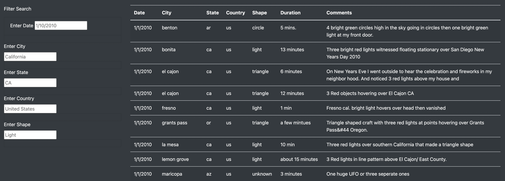

# UFOs

## Overview 

In this analysis, I build a dynamic webpage that portrays data on a table of UFO sightings extracted from a JavaScript data file. In building this webpage I used the Bootstrap library for HTML, CS and, JS codes to visualize the page. The filters filter the data according to date, city, state, country, and shape. With this feature, it is made easier for anyone to filter the data collected from all over the US according to their preferences.

## Results 
When the webpage opens, you encounter a title and an introductory paragraph regarding whether UFO sightings are facts or myths. I then provide a table of UFO findings that was given to me as a JavaScript data file. On the left side of the table, there are several criteria to filter the data: date, city, state, country, and shape. Once a value is entered into the filter the table automatically updates.

 
**Image 1: Title and Introductory Paragraph of Webpage**

 
**Image 2: Data Table**

## Summary 
This is a simple webpage that reflects the JavaScript data file filtered across five criteria. However, there are drawbacks to the design of this webpage.
One of the drawbacks is that it isn't mobile compatible. I would recommend adjusting the design for mobile compatibility. A second feature I would add to further develop the webpage would be fixing the 'Filter Search' bar to the left, so as I scroll down the data I will always see how I filtered the data.